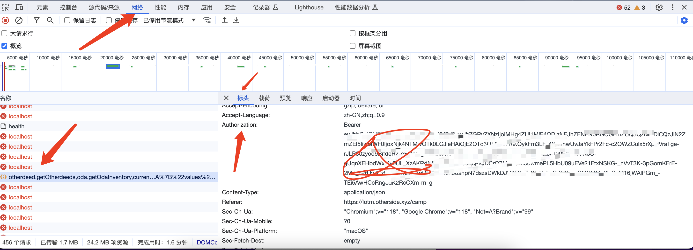

# a bot for LOTM(Legends of the Mara)

### 功能
#### 1.宝箱掉落报警
#### 2.定时输出打怪进度
#### 3.自动发动冷却技能

----
### 配置
复制 default.json，改名为 config.json，修改以下配置项：

* auth：浏览器开发工具获取http Authorization字段
* wallet: 钱包的地址
* monitorInternalMintues： 监控的间隔分钟数值
* processLog: 输出关卡进度的最小值

----
### chrome如何获取auth
打开lotm主页，打开chrome开发者工具，按照下图获取

----
### 启动

#### ./bin/lotm_bot
